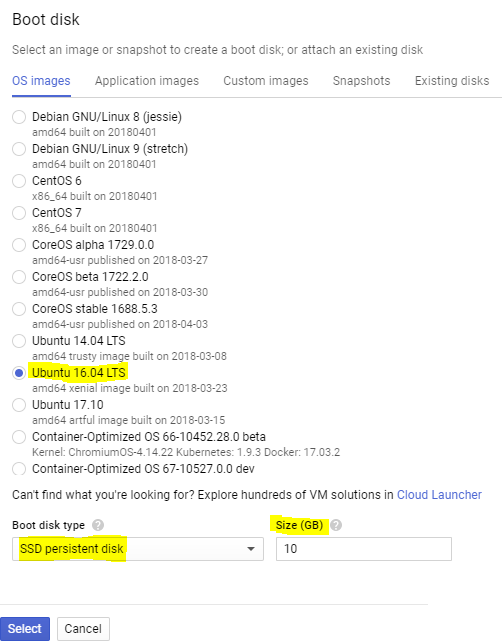
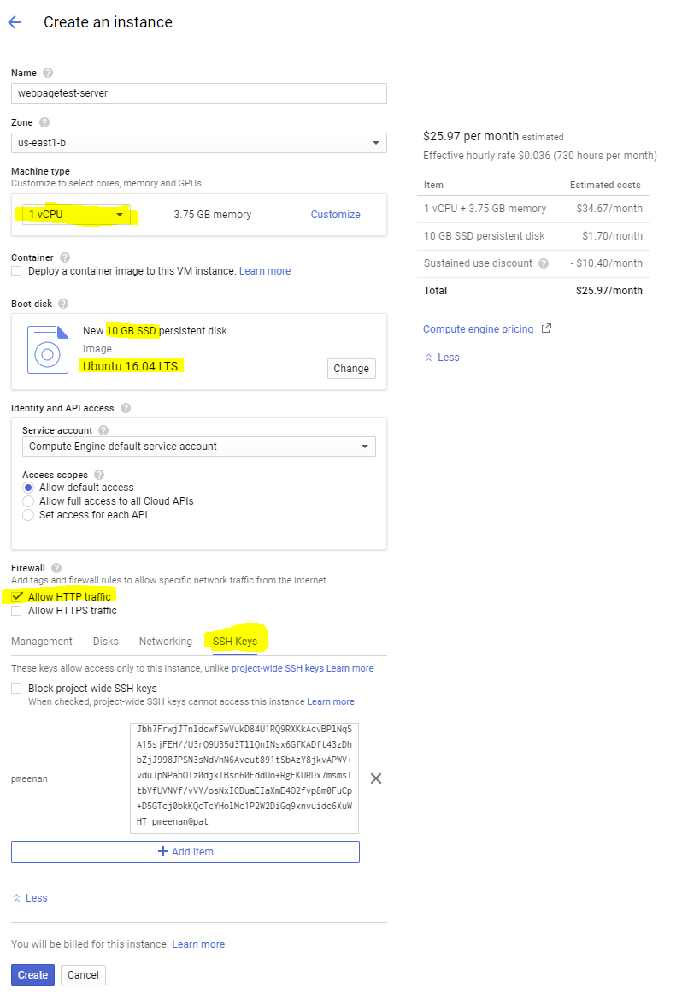

# Google WebPageTest Server

## Create Cloud Storage Bucket (optional)
If you want to keep the tests archived in cloud storage you should set up a bucket and developer key before configuring the WebPageTest Server (the install script will prompt you for the information).  If you will not be archiving tests to cloud storage or plan to configure it manually later you can skip this step.

## Set Up Server

### Start with a Ubuntu 16.04 instance
Create an instance using the Ubuntu 16.04 image and using a SSD persistent disk.  The size of the instance is going to depend on how many agents are going to be connecting to it. the 1-2 CPU instance sizes should handle most deployments though REALLY large deployments with thousands of agents can require up to 32-64 CPU's to handle the web server traffic.  The amount of storage will entirely depend on how many tests are going to be kept on the server before being archived or deleted.  A 1MB average for each test result is a reasonable ballpark for planning purposes.  If archiving to cloud storage, the default settings are configured to archive tests after a day so planning for 2 days of local results should be sufficient.



Make sure that the server is reachable over http from the networks where you want to access it. Also provide a SSH key if you want to use a native SSH client to manage the server instead of the in-browser SSH support from the cloud console.



### Install the server software
SSH into the machine using either the cloud console SSH support or the SSH key that you configured. The server software will be owned by the account used to set it up so make sure you use whatever method you'd like to use to manage the server going forward (if any manual setup is desired later).

Once connected, run the [server install script](https://github.com/WPO-Foundation/wptserver-install#ubuntu-1604-on-google-cloud):
```bash
bash <(curl -s https://raw.githubusercontent.com/WPO-Foundation/wptserver-install/master/gce_ubuntu.sh)
```

You will get prompted for the bucket name if archiving to cloud storage (as well as the API keys).  Otherwise just leave the name blank and hit enter to start the setup.


The installation script will run for a few minutes and when finished it will give you some automatically-configured information:
* An unlimited API key to be used for API-based testing.  More keys can be configured as needed in /var/www/webpagetest/www/settings/keys.ini
* A metadata string to be used for configuring test agents to be able to connect to the server.
* A location key to use if configuring external test agents to connect to the server.

Keep the metadata string handy for configuring the agent instance template if you are going to be running agents in Google Cloud.


### Profit
At this point you have a server that is fully configured an ready to go.  Test locations have automatically been configured for all of the Google Cloud regions.

The web UI is enabled by default and can be reached at http://[server].  Until agents are up and running the location list in the UI will remain empty.  You can see the full list of location ID's by visiting http://[server]/getLocations.php?f=html&hidden=1.

Next: [Configure Test Agents on Google Cloud](gce_agents.md)